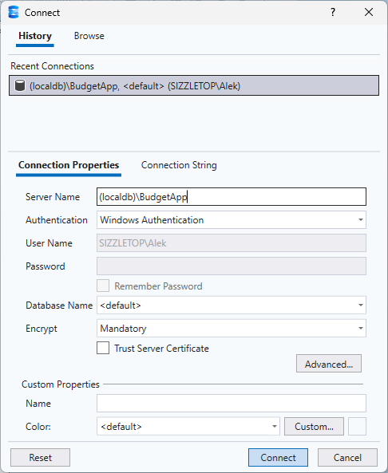
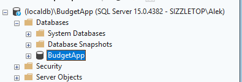

# ClearDollar

**ClearDollar** is a modern, full-stack personal finance application designed to give users granular control over their budget. It features a hierarchical tagging system, interactive visualizations, and transaction management capabilities, built with **ASP.NET Core 9** and **React**.

## Key Features

### 1\. Interactive Dashboard

* **Drill-Down Analytics:** Explore spending and income through dynamic pie charts. Click slices to drill down from Primary Categories (e.g., Food) to Secondary (e.g., Groceries) and Tertiary tags (e.g., Produce).
* **Budget Progress:** Visual progress bars track spending against budget limits for every category.
* **Dual Modes:** Toggle instantly between **Expenses** and **Income** views.

### 2\. Hierarchical Budgeting

* **Multi-Level Tags:** Organize finances with a nested tree structure (Parent \> Child \> Grandchild).
* **Drag-and-Drop Management:** (Planned/Partially Implemented) Reorganize categories easily.
* **Validation Logic:** Backend ensures child category budgets do not exceed their parent's allocation.

### 3\. Transaction Management

* **CSV Import:** Bulk upload transactions via CSV files.
* **Manual Tagging:** Assign or reassign tags to transactions directly from the UI.
* **Optimistic UI:** Instant feedback when updating transaction details.

### 4\. User Data Isolation

* Supports multi-user data isolation (keyed by `UserId`).
* Includes a "Demo User" mode for quick testing.

-----

## Technology Stack

### Frontend

* **Framework:** React 19 + TypeScript
* **Build Tool:** Vite
* **Styling:** Tailwind CSS
* **Charts:** Recharts
* **Routing:** React Router DOM

### Backend

* **Framework:** ASP.NET Core 9.0 Web API
* **ORM:** Entity Framework Core (SQL Server)
* **Language:** C\#
* **API Testing:** `.http` files included

### Database

* **Engine:** Microsoft SQL Server
* **Schema:** Relational tables for `Tags` and `Transactions` with foreign key constraints.

-----

## Setup & Installation

Follow these steps to run the application locally.

### Prerequisites

* [.NET 9.0 SDK](https://dotnet.microsoft.com/download/dotnet/9.0)
* [Node.js](https://nodejs.org/) (Latest LTS recommended)
* [SQL Server](https://www.microsoft.com/en-us/sql-server/sql-server-downloads) (LocalDB or Express)

### 1\. Database Setup

1. **Create the Database:**
    Open a terminal and create a LocalDB instance (or use SSMS to create a DB named `BudgetApp`).

    ```bash
    sqllocaldb create "BudgetApp"
    ```

2. **Initialize Schema & Data:**
    Use SQL Server Management Studio (SSMS) or Azure Data Studio to connect to `(localdb)\BudgetApp`.

    

* Create a database named "BudgetApp"

    

* Execute [sql/CreateTables.qsl](./sql/CreateTables.sql) to create the table structure.

* Execute [sql/DummyData.qsl](./sql/DummyData.sql) to seed the database with demo data for `demo-user`.

### 2\. Backend Setup (`budgetapp.server`)

1. Navigate to the server directory:

    ```bash
    cd budgetapp.server
    ```

2. Review `appsettings.json` to ensure the connection string matches your local SQL instance.

    ```json
    "ConnectionStrings": {
      "WindowsConnection": "Server=(localdb)\\BudgetApp;Database=BudgetApp;Trusted_Connection=True;TrustServerCertificate=True;"
    }
    ```

3. Run the server:

    ```bash
    dotnet run
    ```

    The backend will start (typically on `https://localhost:7038` or `http://localhost:5101`).

### 3\. Frontend Setup (`budgetapp.client`)

1. Navigate to the client directory:

    ```bash
    cd budgetapp.client
    ```

2. Install dependencies:

    ```bash
    npm install
    ```

3. Start the development server:

    ```bash
    npm run dev
    ```

    Vite will proxy API requests (like `/transactions`) to the running .NET backend.

4. Open your browser to the URL shown in the terminal (usually `https://localhost:59946`).

-----

## Usage Guide

1. **Login:** Upon opening the app, enter a User ID (use `demo-user` to see the seeded data).
2. **Dashboard:** View your financial health. Toggle between "Income" and "Expenses" to see different breakdowns. Click pie slices to drill down into specific categories.
3. **Budget Page:** Create new tags, edit budget amounts, and organize your category hierarchy.
4. **Transactions Page:** View all individual transactions. Use the **Import CSV** button to upload new data.
      * *CSV Format Expected:* `Date (MM/dd/yyyy), Amount, Unused, Unused, MerchantDetails`

-----

## Roadmap

* **Bank API Integration:** Replace manual CSV uploads with direct connections via Plaid/Stripe.
* **AI Auto-Tagging:** Integrate LLM logic to automatically suggest tags for imported transactions based on merchant names.
* **Authentication:** Replace the current simple ID system with robust Identity/OAuth implementation.